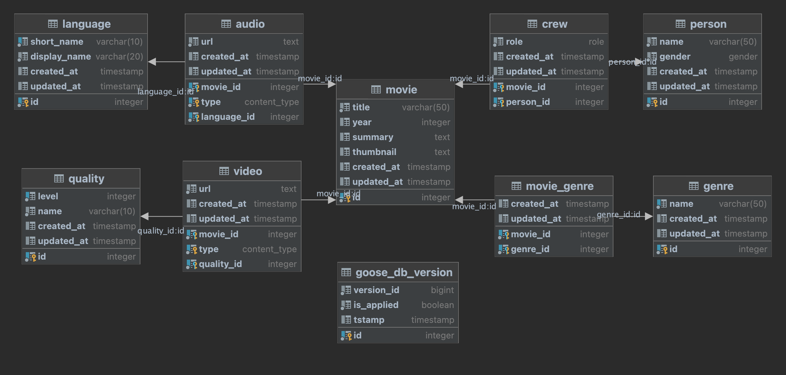

# Go microservice for managing Netflix streaming application data

## Deployment
TODO: add a docker-compose file to build and run repo as a container. Add postgres container.

## Database design

[GORM Models](internal/models/)
<!-- TODO: add an ER diagram for the same -->

## APIs

